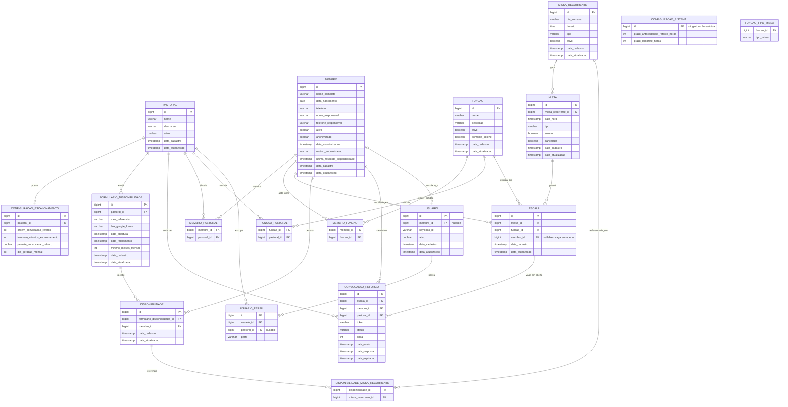

# Diagrama ER — Paróquia em Rede

## Notas de modelagem

- `FUNCAO_TIPO_MISSA` normaliza o atributo multivalorado `Funcao.tiposMissaPermitidos` (`Set<TipoMissa>` no diagrama de classes) numa tabela associativa relacional.
- `CONFIGURACAO_SISTEMA` não tem FK — é singleton (linha única na tabela), diferente de `CONFIGURACAO_ESCALONAMENTO`, que é 1 por `PASTORAL`.
- `MISSA_RECORRENTE` não tem FK para `PASTORAL` — é um padrão da paróquia como um todo. O vínculo com pastoral(is) acontece indiretamente via `FUNCAO` exigida em cada `ESCALA`.
- Enums de domínio (`Perfil`, `TipoMissa`, `StatusConvocacao`) são mapeados como `varchar` + `CHECK constraint`, não enum nativo do Postgres.
