# Diagrama ER — Paróquia em Rede

```mermaid
erDiagram
    PASTORAL ||--o| CONFIGURACAO_ESCALONAMENTO : possui
    PASTORAL ||--o{ FORMULARIO_DISPONIBILIDADE : envia
    PASTORAL ||--o{ CONVOCACAO_REFORCO : "onda de"
    PASTORAL ||--o{ MEMBRO_PASTORAL : vincula
    PASTORAL ||--o{ FUNCAO : possui
    PASTORAL |o--o{ USUARIO_PERFIL : escopo

    MEMBRO ||--o{ MEMBRO_PASTORAL : participa
    MEMBRO ||--o{ MEMBRO_FUNCAO : apto_para
    MEMBRO |o--o{ ESCALA : escalado_em
    MEMBRO ||--o{ DISPONIBILIDADE : declara
    MEMBRO ||--o{ CONVOCACAO_REFORCO : candidato
    MEMBRO |o--o| USUARIO : vinculado_a

    FUNCAO ||--o{ MEMBRO_FUNCAO : requer_aptidao
    FUNCAO ||--o{ ESCALA : exigida_em

    MISSA_RECORRENTE |o--o{ MISSA : gera
    MISSA_RECORRENTE ||--o{ DISPONIBILIDADE_MISSA_RECORRENTE : referenciada_em

    MISSA ||--o{ ESCALA : possui

    ESCALA ||--o{ CONVOCACAO_REFORCO : "vaga em aberto"

    FORMULARIO_DISPONIBILIDADE ||--o{ DISPONIBILIDADE : recebe
    DISPONIBILIDADE ||--o{ DISPONIBILIDADE_MISSA_RECORRENTE : referencia

    USUARIO ||--o{ USUARIO_PERFIL : possui

    PASTORAL {
        bigint id PK
        varchar nome "UNIQUE"
        varchar descricao
        boolean ativo
        boolean elegivel_limite_participacao "default false - habilita RF10.1/RF15.2"
        timestamp data_cadastro
        timestamp data_atualizacao
    }

    CONFIGURACAO_ESCALONAMENTO {
        bigint id PK
        bigint pastoral_id FK
        int ordem_convocacao_reforco
        int intervalo_minutos_escalonamento
        boolean permite_convocacao_reforco
        int dia_geracao_mensal
        boolean prioridade_ativa "default false - só true se demais campos operacionais estiverem preenchidos"
        int limite_missa_semana_comum "nullable - sem teto; exclusivo Super Admin; CHECK >= 0"
        int limite_missa_semana_solene "nullable - sem teto; exclusivo Super Admin; CHECK >= 0"
        int limite_missa_dominical_comum "nullable - sem teto; exclusivo Super Admin; CHECK >= 0"
        int limite_missa_dominical_solene "nullable - sem teto; exclusivo Super Admin; CHECK >= 0"
        timestamp data_cadastro
        timestamp data_atualizacao
    }

    CONFIGURACAO_SISTEMA {
        bigint id PK "singleton - linha única, CHECK (id = 1)"
        int prazo_antecedencia_reforco_horas
        int prazo_lembrete_horas
        timestamp data_cadastro
        timestamp data_atualizacao
    }

    MEMBRO {
        bigint id PK
        varchar nome_completo
        date data_nascimento
        varchar telefone "NOT NULL"
        varchar nome_responsavel
        varchar telefone_responsavel "obrigatório se menor de 18 anos - CHECK constraint"
        boolean ativo
        boolean anonimizado
        timestamp data_anonimizacao
        varchar motivo_anonimizacao
        timestamp ultima_resposta_disponibilidade
        timestamp data_cadastro
        timestamp data_atualizacao
    }

    MEMBRO_PASTORAL {
        bigint membro_id FK
        bigint pastoral_id FK
    }

    FUNCAO {
        bigint id PK
        bigint pastoral_id FK "NOT NULL - dona da função, 1:N, não mais N:N"
        varchar nome
        varchar descricao
        boolean ativo
        boolean somente_solene
        varchar complexidade "SIMPLES ou COMPLEXA - NOT NULL, CHECK constraint"
        varchar tipo_minimo "COMUM/DOMINICAL/ESPECIAL - NOT NULL, CHECK constraint - degrau mínimo de elegibilidade hierárquica"
        timestamp data_cadastro
        timestamp data_atualizacao
    }

    MEMBRO_FUNCAO {
        bigint membro_id FK
        bigint funcao_id FK
    }

    MISSA_RECORRENTE {
        bigint id PK
        varchar dia_semana
        time horario
        varchar tipo "restrito a COMUM/DOMINICAL - CHECK constraint"
        boolean ativo
        timestamp data_cadastro
        timestamp data_atualizacao
    }

    MISSA {
        bigint id PK
        bigint missa_recorrente_id FK "obrigatório se tipo <> ESPECIAL; sempre nulo se tipo = ESPECIAL"
        timestamp data_hora
        varchar tipo "sincronizado com MissaRecorrente.tipo via trigger, quando há vínculo"
        boolean solene
        boolean cancelada
        timestamp data_cadastro
        timestamp data_atualizacao
    }

    ESCALA {
        bigint id PK
        bigint missa_id FK
        bigint funcao_id FK
        bigint membro_id FK "nullable - vaga em aberto"
        timestamp data_cadastro
        timestamp data_atualizacao
    }

    FORMULARIO_DISPONIBILIDADE {
        bigint id PK
        bigint pastoral_id FK
        varchar mes_referencia
        varchar link_google_forms
        timestamp data_abertura
        timestamp data_fechamento
        int minimo_missas_mensal
        timestamp data_cadastro
        timestamp data_atualizacao
    }

    DISPONIBILIDADE {
        bigint id PK
        bigint formulario_disponibilidade_id FK
        bigint membro_id FK
        timestamp data_cadastro
        timestamp data_atualizacao
    }

    DISPONIBILIDADE_MISSA_RECORRENTE {
        bigint disponibilidade_id FK
        bigint missa_recorrente_id FK
    }

    CONVOCACAO_REFORCO {
        bigint id PK
        bigint escala_id FK
        bigint membro_id FK
        bigint pastoral_id FK
        varchar token
        varchar status "PENDENTE/CONFIRMADO/EXPIRADO/INVALIDADO - ver nota abaixo"
        int onda
        timestamp data_envio
        timestamp data_resposta
        timestamp data_expiracao
        timestamp data_cadastro
        timestamp data_atualizacao
    }

    USUARIO {
        bigint id PK
        bigint membro_id FK "nullable"
        varchar keycloak_id
        boolean ativo
        timestamp data_cadastro
        timestamp data_atualizacao
    }

    USUARIO_PERFIL {
        bigint id PK
        bigint usuario_id FK
        bigint pastoral_id FK "nullable - obrigatório apenas se perfil = ADMIN_PASTORAL"
        varchar perfil
        timestamp data_cadastro
        timestamp data_atualizacao
    }
```



## Notas de modelagem

- **`Funcao.tipoMinimo`** substitui a antiga tabela `FUNCAO_TIPO_MISSA`. Não é mais um conjunto arbitrário de tipos permitidos — é uma hierarquia estrita de 3 níveis: `COMUM < DOMINICAL < ESPECIAL`. Uma `Funcao` é elegível pra qualquer `Missa` cujo `tipo` seja igual ou "acima" do seu `tipoMinimo`. Ex.: `tipoMinimo = COMUM` serve em `COMUM`, `DOMINICAL` e `ESPECIAL`; `tipoMinimo = ESPECIAL` só serve em `ESPECIAL`. Isso elimina combinações inconsistentes que a tabela associativa antiga permitia.
- `CONFIGURACAO_SISTEMA` não tem FK — é singleton (linha única na tabela, garantido por `CHECK (id = 1)`), diferente de `CONFIGURACAO_ESCALONAMENTO`, que é 1 por `PASTORAL`.
- `MISSA_RECORRENTE` não tem FK para `PASTORAL` — é um padrão da paróquia como um todo. O vínculo com pastoral(is) acontece indiretamente via `FUNCAO` exigida em cada `ESCALA`.
- Enums de domínio (`Perfil`, `TipoMissa`, `StatusConvocacao`, `Complexidade`) são mapeados como `varchar` + `CHECK constraint`, não enum nativo do Postgres.
- **`Funcao.pastoral_id` é 1:N, não mais N:N, e `NOT NULL`.** Cada `Funcao` pertence a exatamente uma `Pastoral` — nunca zero, nunca duas.
```sql
  ALTER TABLE funcao ALTER COLUMN pastoral_id SET NOT NULL;
```
- **Aptidão cruzada entre Pastorais** é modelada só via `MEMBRO_FUNCAO`, sem nenhuma regra automática ou atribuição em massa.
- **`Funcao.complexidade`** (`SIMPLES`/`COMPLEXA`) determina se um Membro pode acumular múltiplas Funções na mesma Missa gerada automaticamente (não se aplica ao preenchimento manual de Missa especial).
- **`Pastoral.elegivel_limite_participacao`** habilita, para aquela `Pastoral`, os campos de limite em `CONFIGURACAO_ESCALONAMENTO` e a participação no algoritmo de prioridade. Hoje, só Acólitos e Coroinhas têm esse flag `true`.
- **`ConfiguracaoEscalonamento.prioridade_ativa`** (default `false`) controla se a prioridade Acólito/Coroinha de fato entra em ação. Só pode ser `true` se os campos operacionais básicos (`ordem_convocacao_reforco`, `intervalo_minutos_escalonamento`, `dia_geracao_mensal`) já estiverem preenchidos. Enquanto `false` — incluindo o caso de `ConfiguracaoEscalonamento` nem existir pra aquela Pastoral — o sorteio cai no comportamento padrão, sem prioridade nem limites.
- Os 4 campos de limite em `CONFIGURACAO_ESCALONAMENTO` são `NULL` (sem teto) ou `>= 0`:
```sql
  ALTER TABLE configuracao_escalonamento
    ADD CONSTRAINT chk_limite_semana_comum CHECK (limite_missa_semana_comum IS NULL OR limite_missa_semana_comum >= 0),
    ADD CONSTRAINT chk_limite_semana_solene CHECK (limite_missa_semana_solene IS NULL OR limite_missa_semana_solene >= 0),
    ADD CONSTRAINT chk_limite_dominical_comum CHECK (limite_missa_dominical_comum IS NULL OR limite_missa_dominical_comum >= 0),
    ADD CONSTRAINT chk_limite_dominical_solene CHECK (limite_missa_dominical_solene IS NULL OR limite_missa_dominical_solene >= 0);
```
- `Missa.missa_recorrente_id` é nullable: apenas missas do tipo `ESPECIAL` podem existir sem uma `MissaRecorrente` associada, e nesse caso o vínculo é **sempre nulo**. Missas `COMUM`/`DOMINICAL` sempre exigem o vínculo:
```sql
  CHECK (
    (tipo <> 'ESPECIAL' AND missa_recorrente_id IS NOT NULL)
    OR (tipo = 'ESPECIAL' AND missa_recorrente_id IS NULL)
  )
```
- `MissaRecorrente.tipo` é restrito a `CHECK (tipo IN ('COMUM', 'DOMINICAL'))`.
- `Missa.tipo` é sincronizado automaticamente com `MissaRecorrente.tipo` via trigger, sempre que `missa_recorrente_id` não é nulo:
```sql
  CREATE OR REPLACE FUNCTION sincroniza_tipo_missa() RETURNS TRIGGER AS $$
  BEGIN
    IF NEW.missa_recorrente_id IS NOT NULL THEN
      SELECT tipo INTO NEW.tipo FROM missa_recorrente WHERE id = NEW.missa_recorrente_id;
    END IF;
    RETURN NEW;
  END;
  $$ LANGUAGE plpgsql;

  CREATE TRIGGER trg_sincroniza_tipo_missa
    BEFORE INSERT OR UPDATE ON missa
    FOR EACH ROW EXECUTE FUNCTION sincroniza_tipo_missa();
```
- `Membro.telefone_responsavel` é obrigatório quando o membro é menor de idade:
```sql
  CHECK (
    data_nascimento IS NULL
    OR AGE(CURRENT_DATE, data_nascimento) >= INTERVAL '18 years'
    OR telefone_responsavel IS NOT NULL
  )
```
- `Usuario_perfil.pastoral_id` só é preenchido quando `perfil = 'ADMIN_PASTORAL'`:
```sql
  CHECK (
    (perfil = 'ADMIN_PASTORAL' AND pastoral_id IS NOT NULL)
    OR (perfil <> 'ADMIN_PASTORAL' AND pastoral_id IS NULL)
  )
```
  Com dois índices únicos parciais:
```sql
  CREATE UNIQUE INDEX usuario_perfil_global_uk
    ON usuario_perfil (usuario_id, perfil)
    WHERE pastoral_id IS NULL;

  CREATE UNIQUE INDEX usuario_perfil_escopado_uk
    ON usuario_perfil (usuario_id, pastoral_id, perfil)
    WHERE pastoral_id IS NOT NULL;
```
- `Escala` tem `UNIQUE (missa_id, funcao_id, membro_id)`.
- `FormularioDisponibilidade` tem `UNIQUE (pastoral_id, mes_referencia)`.
- `Disponibilidade` tem `UNIQUE (formulario_disponibilidade_id, membro_id)`.
- **`Missa.cancelada = true` suprime toda automação futura** (criação de vaga por solenidade, disparo de reforço, envio de lembrete).
- **`ConvocacaoReforco.status = INVALIDADO`** é usado quando a confirmação atômica (RF20) preenche a vaga por outra via, e as demais `ConvocacaoReforco` pendentes da mesma vaga precisam ser marcadas como obsoletas (evita que um segundo Membro confirme um token pra vaga já preenchida). Lógica exata de invalidação: Frente 5.
